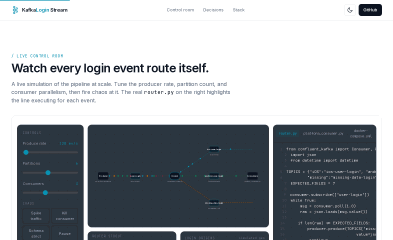
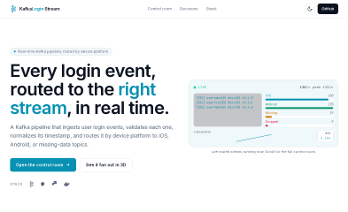
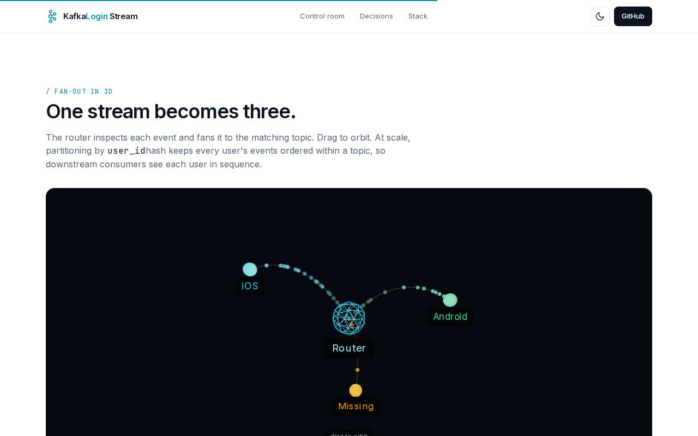
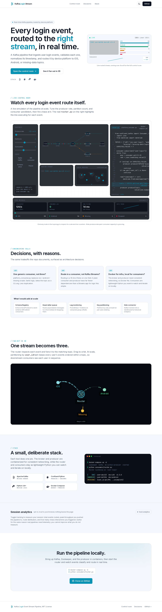

# Kafka Login Event Stream Pipeline

A real-time streaming pipeline that ingests user login events from Kafka, routes them by device platform (iOS / Android / missing data), and delivers them to downstream topic-specific consumers. Built with Confluent Kafka, Python, and Docker.

## Interactive Landing Page (Live)

A live, interactive "control room" for this pipeline, in [`/landing`](./landing). Watch login events route in real time, tune producer rate, partitions, and consumer parallelism, fire chaos (traffic spike, kill a consumer, schema strict), and see the real `router.py` highlight the line executing for each event. Plus a 3D fan-out view and opt-in session analytics.

Live site: https://kafka-login-stream.vercel.app

| Hero live stream | Control room (spike traffic) |
|:---:|:---:|
|  |  |

| Opt-in session analytics | 3D fan-out |
|:---:|:---:|
|  |  |

Full page:



Run locally: `cd landing && npm install && npm run dev`, then open http://localhost:3000

---

## Data Flow

```
┌──────────────────────┐
│   Producer (Docker)   │   Generates simulated login events
│   user-login topic    │   (user_id, device_type, timestamp,
└──────────┬───────────┘    IP, locale, app_version, device_id)
           │
           ▼
┌──────────────────────┐
│   Router Consumer     │   Reads from 'user-login', transforms
│   consumers/router.py │   timestamps, checks field completeness,
└──────┬───┬───┬───────┘   routes by device_type
       │   │   │
       ▼   ▼   ▼
  ┌────┐ ┌────┐ ┌────────┐
  │iOS │ │Andr│ │Missing │    3 downstream topics
  │    │ │oid │ │Data    │
  └──┬─┘ └──┬─┘ └───┬────┘
     │      │       │
     ▼      ▼       ▼
  ┌──────────────────────┐
  │  Platform Consumer    │   Generic consumer — pass any
  │  (one per topic)      │   topic name as CLI argument
  └──────────────────────┘
```

---

## What the Router Does

The router (`consumers/router.py`) is the core of the pipeline. For each incoming message it:

1. Parses the JSON payload
2. Checks field completeness (expects 7 fields) — incomplete records go to `missing-data-login`
3. Drops records with null `user_id`
4. Converts the Unix timestamp to a readable datetime string
5. Routes to `ios-user-login` or `android-user-login` based on `device_type`

---

## Quick Start

### 1. Start Kafka + Producer

```bash
docker-compose up -d
```

This launches Zookeeper, Kafka broker, and a pre-built producer container that starts generating login events on the `user-login` topic.

### 2. Start the Router

```bash
pip install -r requirements.txt
python consumers/router.py
```

You'll see messages being classified and routed in real time:

```
[    IOS]  user=abc123  time=2025-03-15 14:22:01
[ANDROID]  user=def456  time=2025-03-15 14:22:02
[MISSING]  {'user_id': 'ghi789', ...}
```

### 3. Start Platform Consumers (separate terminals)

```bash
python consumers/platform_consumer.py ios-user-login
python consumers/platform_consumer.py android-user-login
python consumers/platform_consumer.py missing-data-login
```

Each consumer listens on its topic and prints messages as they arrive.

### 4. Stop Everything

```bash
docker-compose down
```

---

## Repo Structure

```
kafka-login-stream-pipeline/
├── consumers/
│   ├── router.py              # Routes login events by device_type
│   └── platform_consumer.py   # Generic topic consumer (pass topic as arg)
├── docker-compose.yml         # Kafka + Zookeeper + Producer
├── requirements.txt
├── .gitignore
└── README.md
```

---

## Message Schema

The producer generates JSON messages with this structure:

```json
{
    "user_id": "abc123",
    "app_version": "2.3.0",
    "device_type": "iOS",
    "ip": "192.168.1.1",
    "locale": "en_US",
    "device_id": "device-xyz",
    "timestamp": 1710512521
}
```

After routing, the `timestamp` field is converted to a human-readable format:

```json
{
    "user_id": "abc123",
    "device_type": "iOS",
    "timestamp": "2025-03-15 14:22:01",
    ...
}
```

---

## Design Decisions

**Why a single generic consumer instead of 3 separate scripts?**
The original had `ios-user-login.py`, `android-user-login.py`, and `missing-data-login.py` — all nearly identical except for the topic name and group ID. `platform_consumer.py` replaces all three with one script that takes the topic as a CLI argument. Less duplication, easier to maintain.

**Why route in a consumer instead of using Kafka Streams?**
For a lightweight pipeline with simple routing logic (if/else on a single field), a plain consumer + producer is simpler and has fewer dependencies than a Kafka Streams application. The routing logic is ~10 lines of Python. If the routing rules grew more complex (regex matching, ML-based classification), Kafka Streams or ksqlDB would be the right next step.

**Why Docker for infrastructure but not for consumers?**
The Kafka broker and producer need consistent networking and configuration — Docker handles this well. The consumer scripts are lightweight Python that benefit from running locally where you can see output in real time and iterate quickly.

---

## What I'd Add at Scale

- **Schema Registry** — Enforce Avro or Protobuf schemas on the `user-login` topic to catch schema drift before it hits consumers
- **Dead letter queue** — Route unparseable messages to a DLQ topic instead of dropping them silently
- **Monitoring** — Kafka lag monitoring via Prometheus + Grafana to track consumer group offsets
- **Partitioning strategy** — Partition by `user_id` hash to enable exactly-once processing per user
- **Sink connector** — Kafka Connect to write routed events to a data warehouse (Snowflake, BigQuery) for historical analytics

---

## Tools

| Tool | Purpose |
|------|---------|
| [Apache Kafka](https://kafka.apache.org/) | Message broker |
| [Confluent Kafka Python](https://github.com/confluentinc/confluent-kafka-python) | Producer/consumer client |
| [Docker](https://www.docker.com/) | Kafka + Zookeeper + producer containers |
| Python 3.8+ | Consumer logic |

---

## License

MIT
